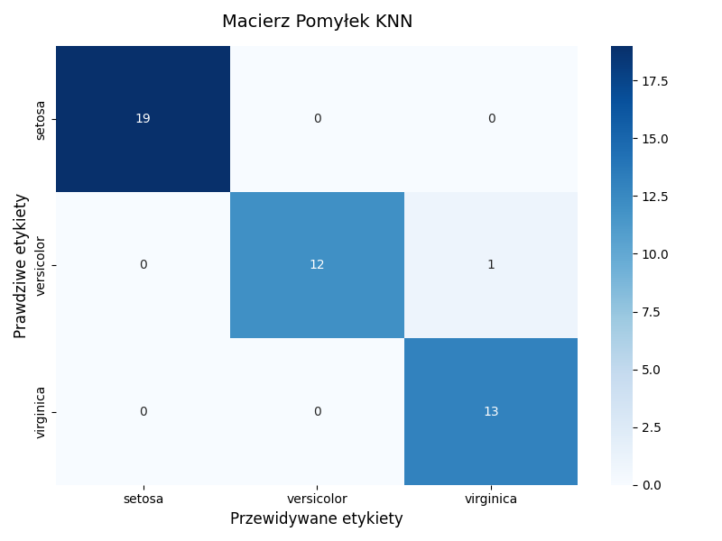
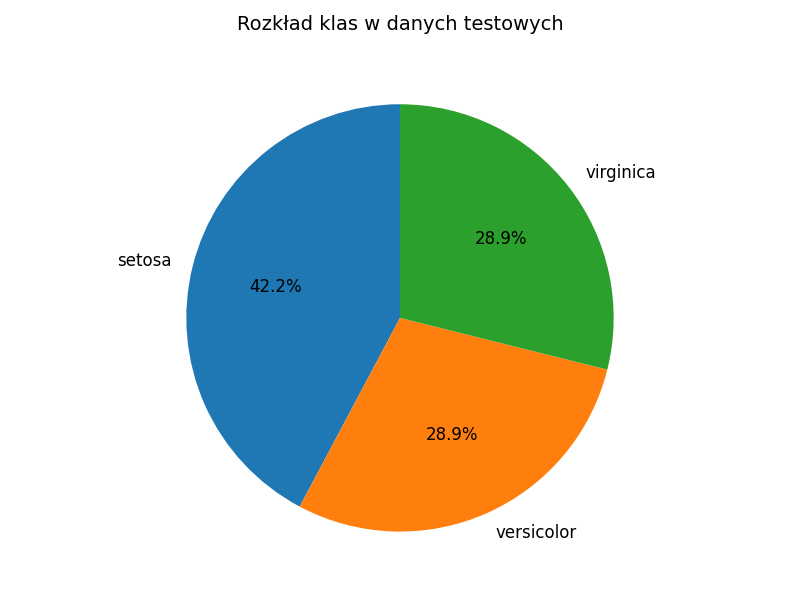
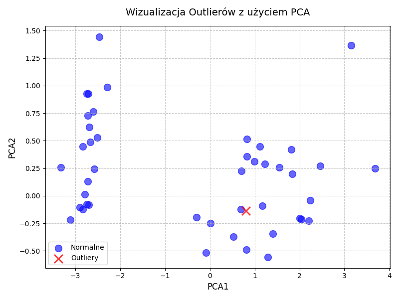

# 🔍 KNN Algorithm with PCA and Outlier Detection

This project demonstrates the K-Nearest Neighbors (KNN) algorithm combined with Principal Component Analysis (PCA) for dimensionality reduction and outlier detection, using the Iris dataset. Documentation is in Polish.

---

## ⚙️ Opis działania

1. **Skalowanie danych:** Dane treningowe i testowe są normalizowane przy użyciu `StandardScaler`.
2. **Redukcja wymiarowości:** PCA redukuje dane do 2 wymiarów, co ułatwia klasyfikację i wizualizację.
3. **Klasyfikacja KNN:** Klasyfikacja opiera się na k najbliższych sąsiadach (domyślnie k=5) z wykorzystaniem metryki euklidesowej.
4. **Wykrywanie outlierów:** Punkt jest oznaczany jako outlier, jeśli większość k najbliższych sąsiadów ma inną etykietę niż prawdziwa.
5. **Wizualizacja:** Wyniki są prezentowane w przestrzeni 2D, gdzie normalne punkty to niebieskie kółka, a outliery to czerwone krzyżyki.

---

## 📊 Eksperyment

- **Dane:** Zbiór `load_iris()` z `sklearn.datasets`
- **Próbki:** 150
- **Atrybuty:** 4 cechy (długość/szerokość płatka i działki kielicha)
- **Klasy:** 3 gatunki irysa (Setosa, Versicolor, Virginica)

**Metody oceny:**
- Dokładność (accuracy)
- Macierz pomyłek (confusion matrix)
- Wizualizacja outlierów w przestrzeni 2D po PCA
- Rozkład klas i liczba wykrytych outlierów

---

## 🖼️ Wyniki

### 📌 Dokładność

Dokładność modelu KNN na danych testowych wynosi **97.78%**.

### 📌 Macierz pomyłek – KNN

Macierz pomyłek dla klasyfikatora KNN na danych testowych (3 klasy: Setosa, Versicolor, Virginica):



### 📌 Rozkład klas w danych testowych

Rozkład klas w zestawie testowym (45 próbek):



### 📌 Liczba wykrytych outlierów

Liczba punktów normalnych (44) i outlierów (1) w zestawie testowym:



### 📌 Wizualizacja outlierów

Wyniki wykrywania outlierów są wizualizowane w przestrzeni 2D po redukcji PCA, gdzie normalne punkty są oznaczone niebieskimi kółkami, a outliery czerwonymi krzyżykami (zob. `main.py`).

---

## 🧠 Wnioski

- Dokładność 97.78% wskazuje na wysoką skuteczność modelu KNN po redukcji PCA.
- Macierz pomyłek pokazuje pojedynczy błąd w klasyfikacji Versicolor jako Virginica.
- Wykryto tylko jeden outlier, co sugeruje, że dane Iris są spójne.
- Model umożliwia regulację parametru k oraz metryki odległości (euklidesowa lub Manhattan).
- Wizualizacja w 2D ułatwia interpretację wyników i identyfikację anomalii.

---

## 💡 Uruchamianie

```bash
python main.py
```

---

## 📋 Wymagania

- Python 3.x
- Biblioteki: `numpy`, `scikit-learn`, `matplotlib`

---

## 🛠️ Struktura projektu

- `model.py`: Implementacja klasy `KNNCustom` z funkcją klasyfikacji i wykrywania outlierów.
- `main.py`: Skrypt główny, który wczytuje dane Iris, trenuje model, przeprowadza klasyfikację i wizualizuje wyniki.
